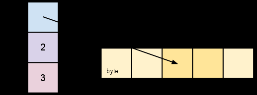

# 学习如何构建一个模块

## 模块简介

该模块为greetings模块，由hello模块调用

## 涉及知识点

### go-slices

#### 0、对比

与Array对比，slice显得更加灵活。slice基于Array，且支持泛型。


An array literal can be specified like so:

```
b := [2]string{"Penn", "Teller"}
```

Or, you can have the compiler count the array elements for you:

```
b := [...]string{"Penn", "Teller"}
```


#### 1、结构：

ptr(*Elem) len(int) cap(int)


slice的长度不能超过cap【如果尝试，会导致runtime panic，就像访问数组长度外的元素一样报错（例如：OutOfIndex）】

#### 2、特点：

切片并没有复制源slice的数据。切片只是产生了一个指向原数组指针的新slice。这让用户操作切片和操作数组index一样方便。因此，在改变切片上的元素之后，原数组对应的元素也会被改变。如下所示：

```
d := []byte{'r', 'o', 'a', 'd'}
e := d[2:]
// e == []byte{'a', 'd'}
e[1] = 'm'
// e == []byte{'a', 'm'}
// d == []byte{'r', 'o', 'a', 'm'}
```




#### 3、如何扩大slice的容量？

##### copy

```
t := make([]byte, len(s), (cap(s)+1)*2) // +1 in case cap(s) == 0
for i := range s {
        t[i] = s[i]
}
s = t
```


The looping piece of this common operation is made easier by the built-in copy function. As the name suggests, copy copies data from a source slice to a destination slice. It returns the number of elements copied.

```
func copy(dst, src []T) int
```


The `copy` function supports copying between slices of different lengths (it will copy only up to the smaller number of elements). In addition, `copy` can handle source and destination slices that share the same underlying array, handling overlapping slices correctly.

Using `copy`, we can simplify the code snippet above:

```
t := make([]byte, len(s), (cap(s)+1)*2)
copy(t, s)
s = t
```


##### Append

A common operation is to append data to the end of a slice. This function appends byte elements to a slice of bytes, growing the slice if necessary, and returns the updated slice value:

```
func AppendByte(slice []byte, data ...byte) []byte {
    m := len(slice)
    n := m + len(data)
    if n > cap(slice) { // if necessary, reallocate
        // allocate double what's needed, for future growth.
        newSlice := make([]byte, (n+1)*2)
        copy(newSlice, slice)
        slice = newSlice
    }
    slice = slice[0:n]
    copy(slice[m:n], data)
    return slice
}
```

One could use `AppendByte` like this:

```
p := []byte{2, 3, 5}
p = AppendByte(p, 7, 11, 13)
// p == []byte{2, 3, 5, 7, 11, 13}
```


But most programs don’t need complete control, so Go provides a built-in `append` function that’s good for most purposes; it has the signature

```
func append(s []T, x ...T) []T
```

The `append` function appends the elements `x` to the end of the slice `s`, and grows the slice if a greater capacity is needed.

```
a := make([]int, 1)
// a == []int{0}
a = append(a, 1, 2, 3)
// a == []int{0, 1, 2, 3}
```


To append one slice to another, use `...` to expand the second argument to a list of arguments.

```
a := []string{"John", "Paul"}
b := []string{"George", "Ringo", "Pete"}
a = append(a, b...) // equivalent to "append(a, b[0], b[1], b[2])"
// a == []string{"John", "Paul", "George", "Ringo", "Pete"}
```


Since the zero value of a slice (`nil`) acts like a zero-length slice, you can declare a slice variable and then append to it in a loop:

```
// Filter returns a new slice holding only
// the elements of s that satisfy fn()
func Filter(s []int, fn func(int) bool) []int {
    var p []int // == nil
    for _, v := range s {
        if fn(v) {
            p = append(p, v)
        }
    }
    return p
}
```

##### Filter

Since the zero value of a slice (`nil`) acts like a zero-length slice, you can declare a slice variable and then append to it in a loop:

```
// Filter returns a new slice holding only
// the elements of s that satisfy fn()
func Filter(s []int, fn func(int) bool) []int {
    var p []int // == nil
    for _, v := range s {
        if fn(v) {
            p = append(p, v)
        }
    }
    return p
}
```

#### 一个可能的“问题”

As mentioned earlier, re-slicing a slice doesn’t make a copy of the underlying array. The full array will be kept in memory until it is no longer referenced. Occasionally this can cause the program to hold all the data in memory when only a small piece of it is needed.(这造成了资源浪费)


For example, this `FindDigits` function loads a file into memory and searches it for the first group of consecutive numeric digits, returning them as a new slice.

```
var digitRegexp = regexp.MustCompile("[0-9]+")

func FindDigits(filename string) []byte {
    b, _ := ioutil.ReadFile(filename)
    return digitRegexp.Find(b)
}
```


To fix this problem one can copy the interesting data to a new slice before returning it:

```
func CopyDigits(filename string) []byte {
    b, _ := ioutil.ReadFile(filename)
    b = digitRegexp.Find(b)
    c := make([]byte, len(b))
    copy(c, b)
    return c
}
```
