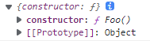

原型链和原型对象是js的核心，js以原型链的形式，保证函数或对象中的方法、属性可以让向下传递，按照面向对象的说法，这就是继承。而**js通过原型链才得以实现函数或对象的继承**，那么下面我们就来聊一聊js中的原型链。

## prototype和contructor

**prototype指向函数的原型对象，这是一个显式原型属性，**只有**函数**才拥有该属性。**contructor**指向原型对象的构造函数。

```text
// 可以思考一下的打印结果，它们分别指向谁
function Foo() {}

console.log(Foo.prototype)
console.log(Foo.prototype.contructor)
console.log(Foo.__proto__)
console.log(Foo.prototype.__proto__)
```

1、console.log(Foo.prototype)



2、console.log(Foo.prototype.contructor)

undefined

【结果有误，根据上面的结果，可知，constructor指向function Foo()】

3、console.log(Foo.\__proto__)

ƒ () { [native code] }

4、console.log(Foo.prototype.\__proto__)


下面来看看各个构造函数与它自己原型对象之间的关系：


## \__proto\_\_

每个对象都有 `_proto_`，它是隐式原型属性，是**对象独有的属性**，指向了创建该对象的**构造函数原型**。由于js中是没有类的概念，而为了实现继承，通过 `_proto_` 将对象和原型联系起来组成原型链，就可以让对象访问到不属于自己的属性。

### 函数和对象之间的关系


Foo、Function和Object都是函数，它们的 `_proto_`都指向 `Function.prototype`。

### 原型对象之间的关系


它们的 `_proto_`都指向了 `Object.prototype`。js原型链最终指向的是Object原型对象

## \_proto_原型链图


相信只要你看懂了上面的图表，那么你应该就已经理解了js的原型链了。

## 总结

- Function 和 Object 是两个函数。
- **proto** 将对象和原型连接起来组成了原型链。
- 所有的函数的 **proto** 都指向Function原型对象。
- **js的原型链最终指向的是Object原型对象(Object.prototype)**（在这里我将null排除在外了）。


    由于constructor属性仅仅是原始构造函数的引用，因此我们可以使用该属性创建新的对象，如：


    通过第一个对象实例化对象的constuctor方法创建第2个实例化对象，说明创建的新对象ninja2 是Ninja的实例，由于ninja和ninja2不是同一个对象可以得出它们是两个截然不同的实例；

作者：super_wei
链接：https://www.jianshu.com/p/08c07a953fa0
来源：简书
著作权归作者所有。商业转载请联系作者获得授权，非商业转载请注明出处。
