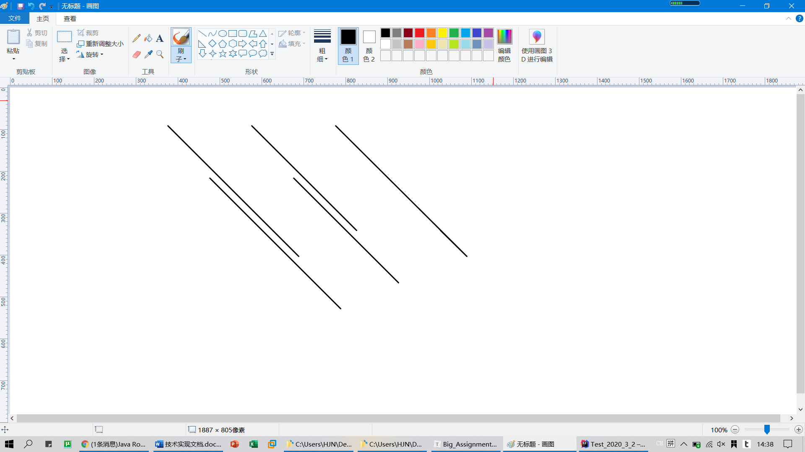
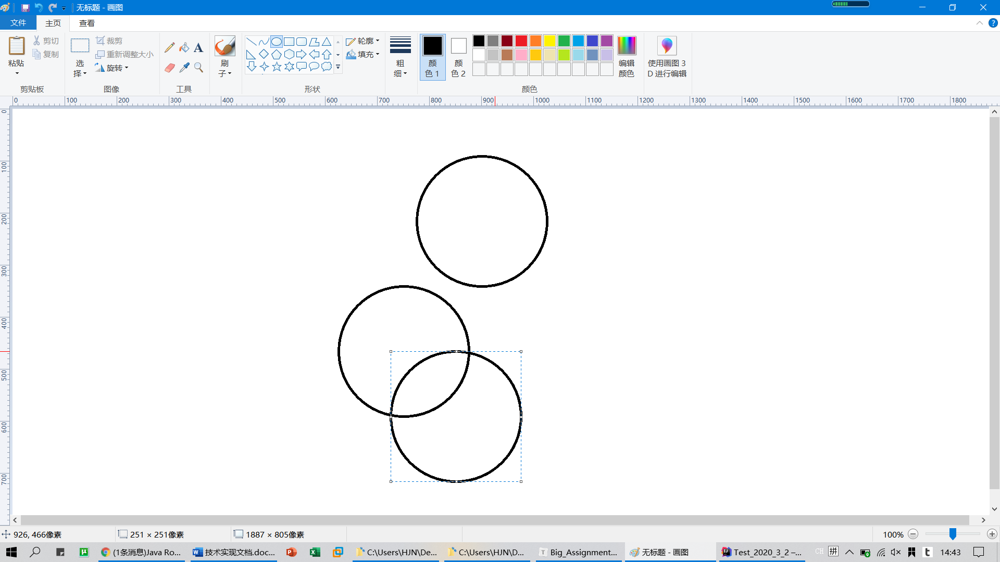
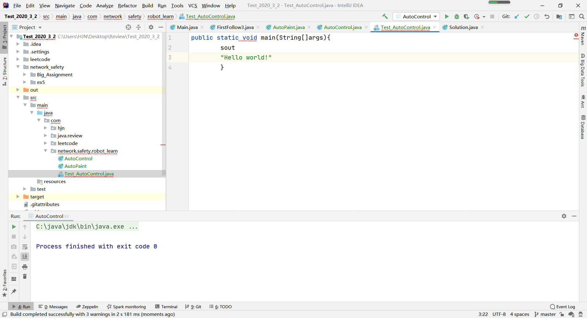

# 大作业1

时间：2020.6.18-2020.6.21

成员：黄江南 张嘉熙 谭渝川 凌翔


## 1 学习java.awt.robot

### 1.1 阅读博客：

https://blog.csdn.net/qq_38901340/article/details/99225140


#### 实例1-鼠标：

```java
//robot鼠标事件一个小栗子：
 
//////////////////////////////////////////////////////
package auto_control;
 
import java.awt.*;
import java.awt.event.InputEvent;
 
/**
 * @Author Javee
 * @Date 2019/8/9 14:43
 * @Description 写一个脚本，打开电脑画板后，自动在画板上画一个奥运五环
 */
public class AutoPaint {
    public static void main(String[] args) throws AWTException {
        Robot robot = new Robot();
        robot.delay(3000); //运行代码后，暂停三秒，留够时间去打开电脑自带的画板，并点击形状里面的椭圆形
 
        //1111111111111111111111
        int i = 10;
        while (i-- > 0) {
            robot.mouseMove(400, 300);
        }
        robot.mousePress(InputEvent.BUTTON1_MASK);
        robot.delay(100);       //这里延迟0.1s，可以看到动态画的过程
        i = 10;
        while (i-- > 0) {
            robot.mouseMove(650, 550);
        }
        robot.mouseRelease(InputEvent.BUTTON1_MASK);
        robot.delay(1000);       //画完一个圆停止0.2s，否则因为计算机执行速度太快，看不到动态作图的过程
 
        //222222222222222222222
        i = 10;
        while (i-- > 0) {
            robot.mouseMove(0, 300);
        }
        robot.mousePress(InputEvent.BUTTON1_MASK);
        robot.mouseRelease(InputEvent.BUTTON1_MASK); //画完一个圆后在圆外面点一下鼠标，否则回拖动画的圆到下一个位置
        i = 10;
        while (i-- > 0) {
            robot.mouseMove(600, 300);
        }
        robot.mousePress(InputEvent.BUTTON1_MASK);
        robot.delay(100);       //这里延迟0.1s，可以看到动态画的过程
        i = 10;
        while (i-- > 0) {
            robot.mouseMove(850, 550);
        }
        robot.mouseRelease(InputEvent.BUTTON1_MASK);
        robot.delay(1000);       //画完一个圆停止0.2s，否则因为计算机执行速度太快，看不到动态作图的过程
 
        //3333333333333333333333333
        i = 10;
        while (i-- > 0) {
            robot.mouseMove(0, 300);
        }
        robot.mousePress(InputEvent.BUTTON1_MASK);
        robot.mouseRelease(InputEvent.BUTTON1_MASK); //画完一个圆后在圆外面点一下鼠标，否则回拖动画的圆到下一个位置
        i = 10;
        while (i-- > 0) {
            robot.mouseMove(800, 300);
        }
        robot.mousePress(InputEvent.BUTTON1_MASK);
        robot.delay(100);       //这里延迟0.2s，可以看到动态画的过程
        i = 10;
        while (i-- > 0) {
            robot.mouseMove(1050, 550);
        }
        robot.mouseRelease(InputEvent.BUTTON1_MASK);
        robot.delay(200);       //画完一个圆停止0.1s，否则因为计算机执行速度太快，看不到动态作图的过程
 
        //44444444444444444444444444
        i = 10;
        while (i-- > 0) {
            robot.mouseMove(0, 300);
        }
        robot.mousePress(InputEvent.BUTTON1_MASK);
        robot.mouseRelease(InputEvent.BUTTON1_MASK); //画完一个圆后在圆外面点一下鼠标，否则回拖动画的圆到下一个位置
        i = 10;
        while (i-- > 0) {
            robot.mouseMove(500, 425);
        }
        robot.mousePress(InputEvent.BUTTON1_MASK);
        robot.delay(100);       //这里延迟0.1s，可以看到动态画的过程
        i = 10;
        while (i-- > 0) {
            robot.mouseMove(750, 675);
        }
        robot.mouseRelease(InputEvent.BUTTON1_MASK);
        robot.delay(200);       //画完一个圆停止0.2s，否则因为计算机执行速度太快，看不到动态作图的过程
 
        //555555555555555555555555
        i = 10;
        while (i-- > 0) {
            robot.mouseMove(0, 300);
        }
        robot.mousePress(InputEvent.BUTTON1_MASK);
        robot.mouseRelease(InputEvent.BUTTON1_MASK); //画完一个圆后在圆外面点一下鼠标，否则回拖动画的圆到下一个位置
        i = 10;
        while (i-- > 0) {
            robot.mouseMove(700, 425);
        }
        robot.mousePress(InputEvent.BUTTON1_MASK);
        robot.delay(100);       //这里延迟0.1s，可以看到动态画的过程
        i = 10;
        while (i-- > 0) {
            robot.mouseMove(950, 675);
        }
        robot.mouseRelease(InputEvent.BUTTON1_MASK);
        robot.delay(200);       //画完一个圆停止0.2s，否则因为计算机执行速度太快，看不到动态作图的过程
 
 
    }
}
 
//当然，此代码还可以优化，有兴趣的朋友可以自己尝试优化一下代码，以减少代码量
```

##### 运行截图1：




##### 分析1：

运行之前，未选择椭圆形画笔（画图默认为“刷子”）。此程序操控鼠标进行点击并移动，移动完成后，释放鼠标。


##### 运行截图2：




##### 分析2：

（未画出奥运五环）出现上图的情况是因为鼠标在绘制圆形的时候，误点击其他圆形，使其移动。


#### 实例2-键盘：

```java
//这里我使用的是idea，所以有些快捷键可能不适用于其他编译器
package auto_control;
 
import java.awt.*;
import java.awt.event.KeyEvent;
 
/**
 * @Author Javee
 * @Date 2019/8/9 11:19
 * @Description 使用代码在一个新建的Java文件中写一句代码
 * public static void main(String[] args) {
 *     System.out.println("Hello world!");
 * }
 * 并运行
 */
public class AutoControl {
    public static void main(String[] args) throws AWTException {
        Robot robot = new Robot();
        robot.delay(5000);
        //先模拟输入主方法
        robot.keyPress(KeyEvent.VK_P);
        robot.keyRelease(KeyEvent.VK_P);
        robot.delay(100);
        robot.keyPress(KeyEvent.VK_S);
        robot.keyRelease(KeyEvent.VK_S);
        robot.delay(100);
        robot.keyPress(KeyEvent.VK_V);
        robot.keyRelease(KeyEvent.VK_V);
        robot.delay(100);
        robot.keyPress(KeyEvent.VK_M);
        robot.keyRelease(KeyEvent.VK_M);
 
        robot.delay(500);
        robot.keyPress(KeyEvent.VK_ENTER);
        robot.keyRelease(KeyEvent.VK_ENTER);
        robot.delay(100);
 
        //先模拟电脑输入sout按下回车得到System.out.println();
 
        robot.keyPress(KeyEvent.VK_S);
        robot.keyRelease(KeyEvent.VK_S);
        robot.delay(100);
        robot.keyPress(KeyEvent.VK_O);
        robot.keyRelease(KeyEvent.VK_O);
        robot.delay(100);
        robot.keyPress(KeyEvent.VK_U);
        robot.keyRelease(KeyEvent.VK_U);
        robot.delay(100);
        robot.keyPress(KeyEvent.VK_T);
        robot.keyRelease(KeyEvent.VK_T);
 
        robot.delay(500);
        robot.keyPress(KeyEvent.VK_ENTER);
        robot.keyRelease(KeyEvent.VK_ENTER);
        robot.delay(100);
 
        //在括号里面输入"Hello world!"
        robot.keyPress(KeyEvent.VK_SHIFT);
        robot.keyPress(KeyEvent.VK_QUOTE);
 
        robot.keyRelease(KeyEvent.VK_SHIFT);
        robot.keyRelease(KeyEvent.VK_QUOTE);
        robot.delay(100);
 
        robot.keyPress(KeyEvent.VK_SHIFT);
        robot.keyPress(KeyEvent.VK_H);
        robot.keyRelease(KeyEvent.VK_SHIFT);
        robot.keyRelease(KeyEvent.VK_H);
        robot.delay(100);
        robot.keyPress(KeyEvent.VK_E);
        robot.keyRelease(KeyEvent.VK_E);
        robot.delay(100);
        robot.keyPress(KeyEvent.VK_L);
        robot.keyRelease(KeyEvent.VK_L);
        robot.delay(100);
        robot.keyPress(KeyEvent.VK_L);
        robot.keyRelease(KeyEvent.VK_L);
        robot.delay(100);
        robot.keyPress(KeyEvent.VK_O);
        robot.keyRelease(KeyEvent.VK_O);
        robot.delay(100);
 
        robot.keyPress(KeyEvent.VK_SPACE);
        robot.keyRelease(KeyEvent.VK_SPACE);
        robot.delay(100);
 
        robot.keyPress(KeyEvent.VK_W);
        robot.keyRelease(KeyEvent.VK_W);
        robot.delay(100);
        robot.keyPress(KeyEvent.VK_O);
        robot.keyRelease(KeyEvent.VK_O);
        robot.delay(100);
        robot.keyPress(KeyEvent.VK_R);
        robot.keyRelease(KeyEvent.VK_R);
        robot.delay(100);
        robot.keyPress(KeyEvent.VK_L);
        robot.keyRelease(KeyEvent.VK_L);
        robot.delay(100);
        robot.keyPress(KeyEvent.VK_D);
        robot.keyRelease(KeyEvent.VK_D);
        robot.delay(100);
        robot.keyPress(KeyEvent.VK_SHIFT);
        robot.keyPress(KeyEvent.VK_1);
        robot.keyRelease(KeyEvent.VK_SHIFT);
        robot.keyRelease(KeyEvent.VK_1);
 
        //模拟手动运行
        robot.delay(1000);
        robot.keyPress(KeyEvent.VK_CONTROL);
        robot.keyPress(KeyEvent.VK_SHIFT);
        robot.keyPress(KeyEvent.VK_F10);
        robot.keyRelease(KeyEvent.VK_CONTROL);
        robot.keyRelease(KeyEvent.VK_SHIFT);
        robot.keyRelease(KeyEvent.VK_F10);
    }
}
```

##### 运行截图1：



##### 分析1：

由于键盘输入和快捷键的问题，有些字符未能快速输入


1.2 robot类实现屏幕截取、远程监控