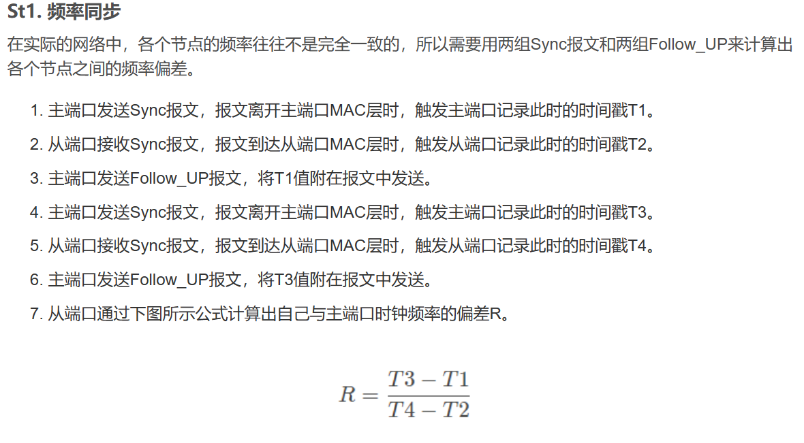
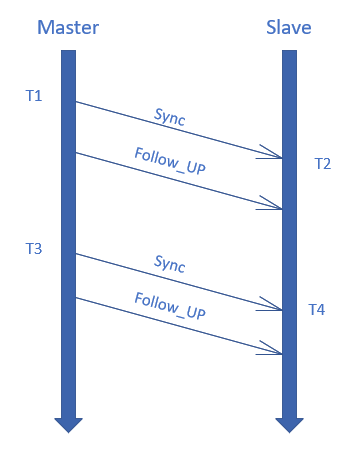
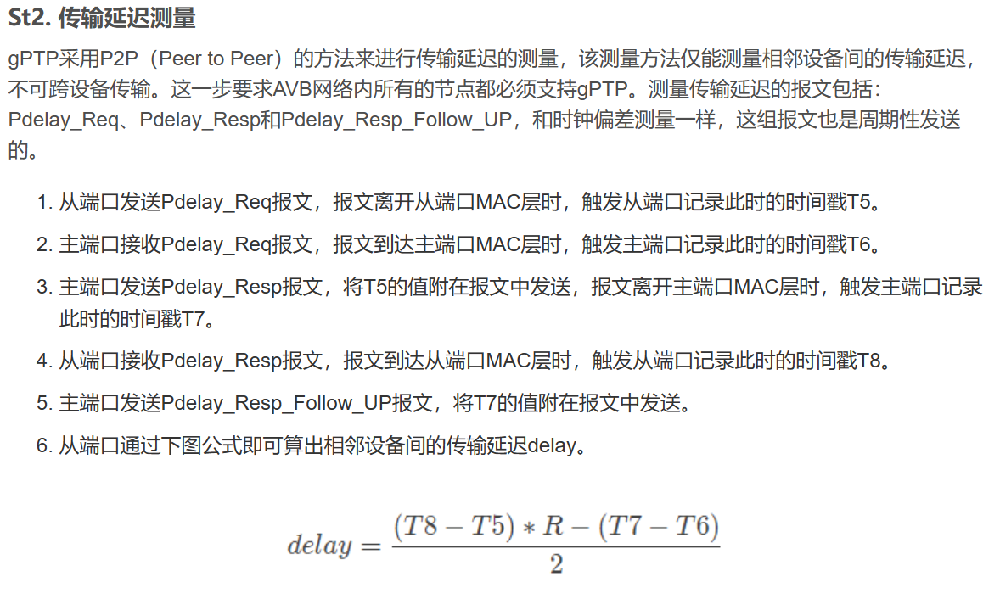
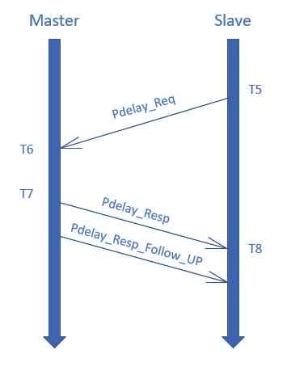
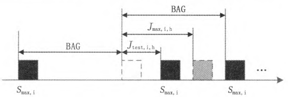

# 网络传输延迟仿真（航空AFDX网络端到端延迟分析技术研究与实践）

## 目的

1）模拟多个消息同时由发送端发出时，可能在每两个网络节点port相连之间的channel中产生排队延迟

2）

## 测试项

| 序号 | 测试项                                                       | 思路                                                                                                             | 问题                                                                                                                                                                                                            | 已完成 | 日期         |
|----|-----------------------------------------------------------|----------------------------------------------------------------------------------------------------------------|---------------------------------------------------------------------------------------------------------------------------------------------------------------------------------------------------------------|-----|------------|
| 1  | 发送方以固定的周期往接收方的队列channel中发送消息                              | 1）创建1个producer 生产者，以refreshPeriod为周期往channel中添加消息flow                                                     |                                                                                                                                                                                                               | √   | 2023.11.27 |
| 2  | 接收方以固定的周期从接收队列channel中接收消息（同时计算消息的延迟）                     | 1）创建1个consumer 消费者，以refreshPeriod为周期来remove队列channel中的消息flow 2）计算消息的延迟                               |                                                                                                                                                                                                               | √   | 2023.11.27 |
| 3  | 生产者一直生产消息，消费者一直接收消息                                       | 1）while (true) 2）生产者消费者模式 3）创建一个channel，两个线程Port，一个是生产者，一个是消费者                                       |                                                                                                                                                                                                               | √   | 2023.11.27 |
| 4  | 使用线程池管理线程task，并使用shutdownNow()停止所有线程                      | 将生产者和消费者Port放入线程池                                                                                              | 1）如果while(true)一直生产消息， 则不能正常interrupt线程 【解决】： 设置线程固定生产10个消息后结束                                                                                                                                 | √   | 2023.11.28 |
| 5  | 接收方接收消息后，按照消息路径将消息发送到下一个队列channel中                        | 1）修改channel和flow 给每个channel配置id 2）配置消息flow要经过的路径                                                     | 1）如果生产者在接收方启动之前， 就开始生产消息，则会导致某些 消息无法被转发出去 【解决】： 最终发送方统一放在最后生成 （或者：所有发送方都要统一等待时间 t，再开始生成消息【因为某些发送方 同时也是接收方】） 【解决】： 使用countDownLatch实现所有生产者 线程的同时启动（在消费者线程之后） | ×   |            |
| 5  | 多个发送端对应一个接收端的情况                                           | 当接收队列（不是channel的keepAndSendQueue， 而是所有发送方发送的数据帧先到达接收方队列中， 汇聚到同一个总的队列）满了， 要向所有发送channel发送wait请求？ |                                                                                                                                                                                                               |     |            |
| 6  | 多个接收端对应一个发送端的情况                                           |                                                                                                                |                                                                                                                                                                                                               |     |            |
| 7  | 管理所有的Port、Channel、flow                                    | Map<int,对应的类>                                                                                                  |                                                                                                                                                                                                               |     |            |
| 8  | channel的接收端不一定是队列端口？                                      | 在初始化channel的时候，传入接收端，根据接收端的接收端口类型， 定义channel在接收数据时的处理逻辑                                                   |                                                                                                                                                                                                               |     |            |
| 9  | 流量规整器（在端系统中）是每个VL都有一个， 则channel和port应该要继续划分，以VL为最小单位 |                                                                                                                |                                                                                                                                                                                                               |     |            |

## 总结

## 思路梳理

### 1 阅读论文

#### 1）A664-P7 的时间同步协议

航空电子中使用的 A664-P7 网络规范没有提供任何定义终端系统上运行的各种应用程序的**通用时间参考**
的方法。在本文中，我们提出了一种算法来提供这样的时间参考。为了支持该提案，我们实现了该算法并使用 OMNeT++ 进行了实验，以探索该方法的鲁棒性。

问题：仿真的时候，是否需要设置时间同步？

2）CSDN：TSN广义时钟gPTP——基于频率

### 2 了解研究顺序

### 3 思路发散

1）考虑对AFDX网络中的每种网络延迟进行分析和对其计算进行改进

A653系统的延迟

交换机内部的延迟

2）

# 网络延迟计算

## 延迟

## 抖动

### 1）引入

传统以太网的网络数据包从发送端发出的时刻和到达交换机的时刻是随机的。在AFDX网络中，基于A664P7协议的规定，为了确保网络的确定性，要求从端系统发出的两个packet之间要间隔一个最小的时间间隔，即BAG（以每个VL为基本单元，流量规整器（流量整形功能）应该对流进行整形，使得在每个BAG间隔中（以毫秒为单位），发送的帧的数目不会多于一个）。同时，在交换机接收packet的时候，接收两个相邻的packet的最小时间间隔也要求为BAG。综上所述，BAG的设立是减少packet在A664网络节点接收和发送时发生碰撞的一种机制。

在实际网络中，想要实现每个packet到达交换机严格遵守BAG时间间隔是不可能的。因此，packet到达交换机的时刻图可能如下所示：

由于数据包没有严格遵守以BAG为时间间隔的规则，而诞生了一个概念——抖动。抖动一般用Jitter表示，其值为两个相邻的数据包的实际到达时刻之差-BAG，描述了第二个数据包到达的时刻超出BAG的部分。A664P7协议的规定A664交换机的带宽是固定的。A664交换机的带宽=（每个VL的最大可使用带宽由它的BAG和被允许的Lmax（最大VL帧大小）所决定。最大可使用带宽=Lmax/BAG，以Kbytes每秒为单位）。因此，如果packet之间的间隔过大，可能会导致交换机无法在下一个packet到来之前处理好当前的packet，导致整体带宽的下降，破坏网络的确定性。

### 2）概念解释

值得一提的是，整流也会有排队产生，不过其延迟（jitter）由A664协议严格限制在500μs内

### 3）作用

用于准确计算带宽利用率
